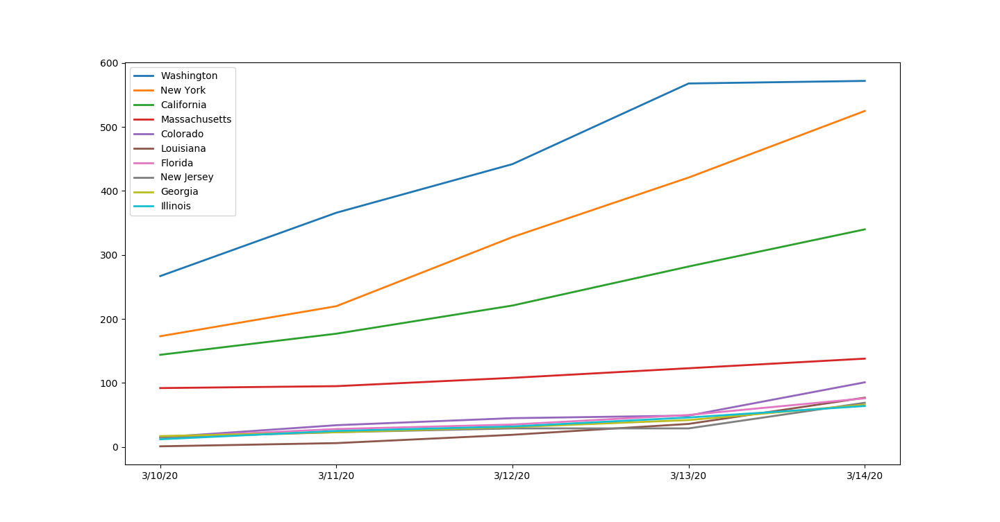

# Daily Visualization and Trend of CoronaVirus cases in US states.
The report shows graphic visulation of top 10 US states by number of cases. I have used data from John Hopkins github repository and then used pandas for data wrangling. I used matplotlib to plot the graphs.

Data is avaiable at John Hopkins University's github repository here: https://github.com/CSSEGISandData/COVID-19

Sample plot

